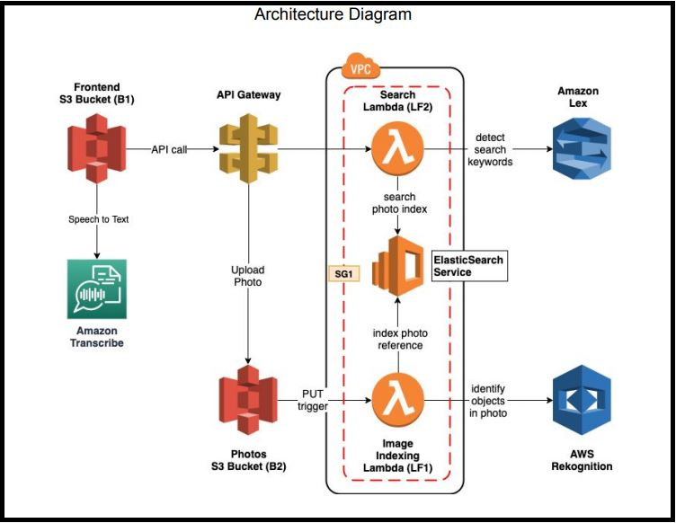

## Demo-URL: 
git remote add origin https://github.com/jay-sarvaiya-21/AI-photo-album.git

## AWS-Photo-Album - Using-Transcribe-Rekognition
This is a photo album web application that is deployed on AWS. The application searches through photos using natural language through both text and voice. Some of the important AWS services that are used are Lex, ElasticSearch, and Rekognition. These services have helped build and create an intelligent search layer to query the photos of people, objects, actions, landmarks and more. We use Amazon Transcribe on the frontend to transcribe speech to text, then use the transcribed text to perform the search.

## Architecture

yoyo
